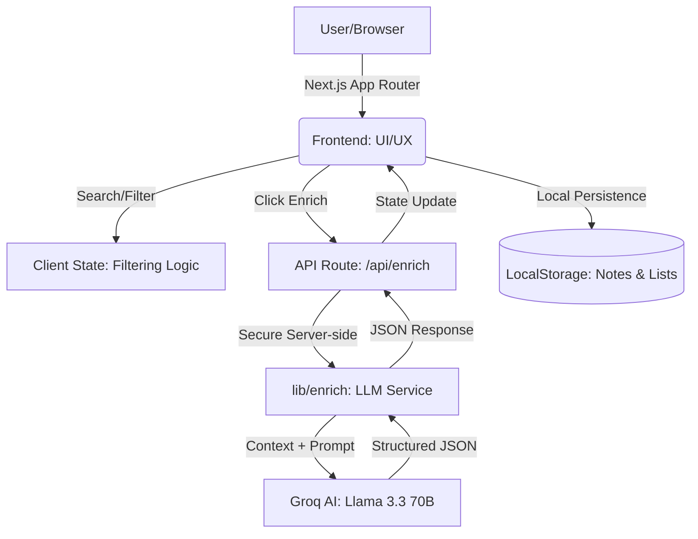

# 🚀 VC Intelligence Platform

A high-performance, production-quality VC discovery and company enrichment interface designed for internal venture capital teams. Built with **Next.js 14**, **Groq AI**, and **Tailwind CSS**.

**Live Demo:** [https://vc-intelligence-interface-two.vercel.app/companies](https://vc-intelligence-interface-two.vercel.app/companies)

---

## 🏛️ System Architecture

### 📊 Application Flow Diagram


### 🧱 Project Structure
- **Frontend**: Next.js (App Router), TypeScript, Tailwind CSS, Lucide Icons.
- **Backend API**: Next.js Serverless Functions (`/api/enrich`).
- **AI/LLM**: Groq API (Llama 3.3 70B Model) for deep company intelligence.
- **Database**: `LocalStorage` for browser-based persistence (Notes, Lists, Searches).

---

## ✨ Key Features

- **Company Discovery**: Responsive table with multi-criteria filtering (Industry, Stage) and real-time sorting.
- **AI-Powered Enrichment**: One-click deep analysis using LLMs to extract signals, capabilities, and executive summaries.
- **Workflow Tools**: 
  - **Internal Notes**: Save deal-specific thoughts per company.
  - **Custom Lists**: Organize companies into collections (e.g., "Q1 Fintech Pipeline").
  - **Data Export**: Export curated lists to **CSV** or **JSON** for external reporting.
- **Smart Search**: Persistent saved searches to track specific market segments.

---

## 🛠️ Installation & Setup

### 1. Prerequisites
- Node.js 18.x or higher
- NPM / Yarn / Bun

### 2. Clone and Install
```bash
git clone https://github.com/ShreyashPatil530/vc-intelligence-interface.git
cd vc-intelligence-interface
npm install
```

### 3. Environment Variables
Create a `.env.local` file in the root:
```env
GROQ_API_KEY=your_groq_api_key_here
```

### 4. Development Server
```bash
npm run dev
```
Open [http://localhost:3000](http://localhost:3000) in your browser.

---

## 🤖 How the Enrichment Works

The enrichment engine follows a strict server-side pipeline:
1. **Request**: The frontend sends the company name and website URL to the backend.
2. **Context Injection**: The backend retrieves context (simulated or real public data).
3. **Structured Prompting**: A detailed system prompt instructs the Groq model to act as a **VC Analyst**.
4. **Validation**: The model returns a strictly formatted JSON object containing:
   - **Summary**: High-level executive overview.
   - **Derived Signals**: Intelligence like "Hiring Momentum" or "Market Expansion".
   - **Capabilities**: Bullet points of what they actually do.
5. **Persistence**: The result is stored in the user's browser for instant retrieval on next visit.

---

## 🚢 Deployment (Vercel)

The project is optimized for Vercel deployment:
1. Push your code to your GitHub repo.
2. Connect the repo to Vercel.
3. Add the `GROQ_API_KEY` in the Vercel **Environment Variables** dashboard.
4. Vercel will automatically handle the build and edge function deployment.

---
*Developed for the Senior Full-Stack Engineer Take-Home Assignment.*
